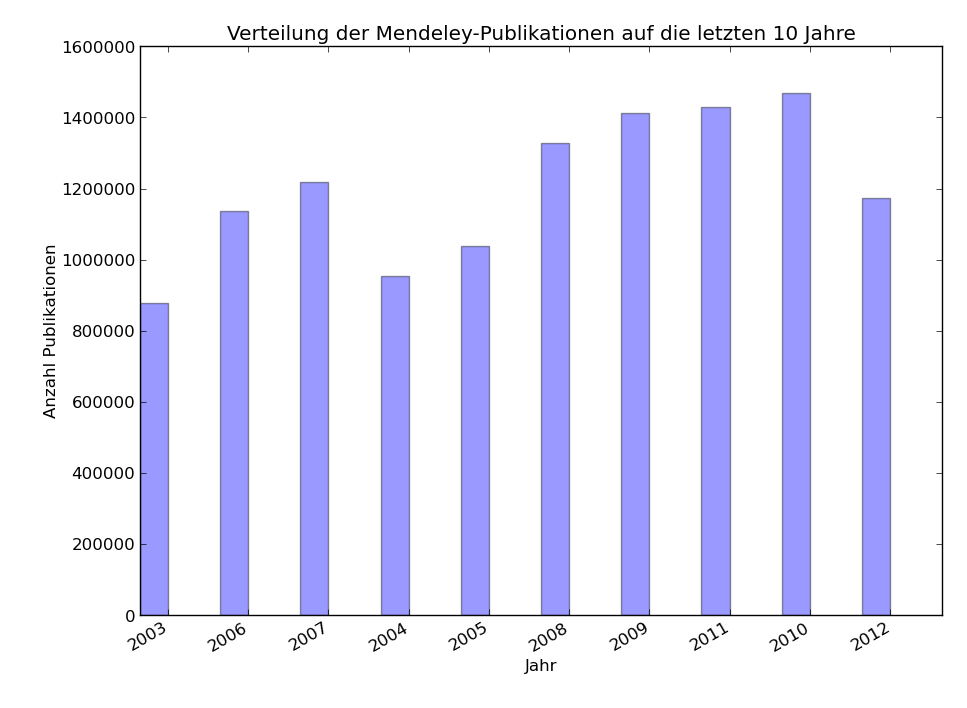
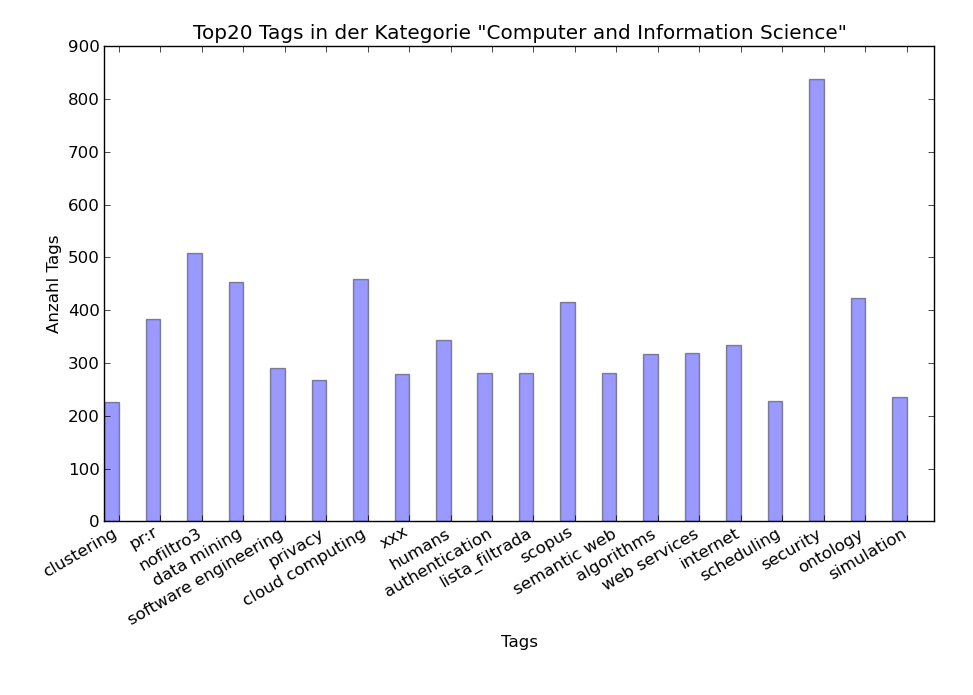
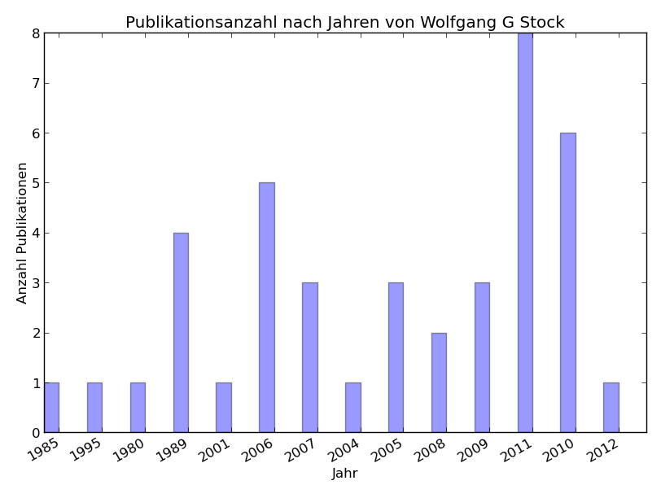
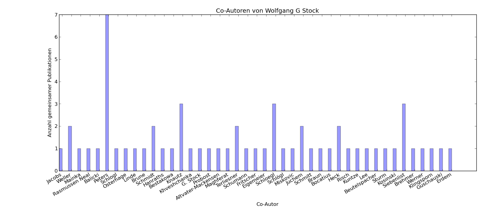
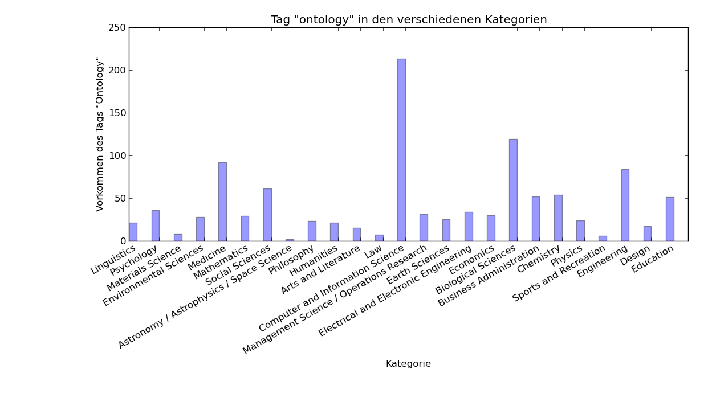

Ergebnisse
==========
Im Folgenden werden unsere Ergebnisse vom Stand 2013 10. Dezember 2013 abgebildet:

Aufgabe 1
---------

Die Verteilung der Publikationen in den letzten 10 Jahren liegt bei durchschnittlich ca. 1200000 Publikationen.
Betrachtet man die Jahre 2004, 2005 und 2012 nicht, so kann man von einer kontinuierlichen Steigung sprechen.

Aufgabe 2
---------

Wie man anhand der Grafik sehen kann, liegt der Schwellwert in der Kategorie "Computer and Information
Science", um unter die Top20 Tags zu kommen, bei einer Anzahl von ca. 220. Platz 1 mach der Tag "security"
mit einer Anzahl von mehr als 800. Dies sind ca. 300 mehr als die Anzahl von "nofiltro3", welches die
zweithoechste Anzahl an Tags in dieser Kategorie besitzt.

Aufgabe 3
---------

Die unlösbare Aufgabe erfordert eine unsichtbare Loesung:

Aufgabe 4a
---------

In den Jahren 2006, 2010 und 2011 war Herr Stock am produktivsten. Eine graduelle Entwicklung ist
leider nicht zu sehen.

Aufgabe 4b
---------

Insgesamt wurden 43 Co-Autoren gefunden. Hier ist ein Autor mit dem Nachnamen "G. Stock" gelistet,
welches durch das fehlerhafte Indexieren dieses Dokumentes in unserer Abfrage mit aufgenommen wurde.
Auffaellig ist, dass Herr Stock groeßtenteils nur mit Mitarbeitern aus seiner Abteilung (Weller, Heck,
Siebenlist, Terliesner, Peters) mehr als ein Dokument verfasst hat.

Aufgabe 5
---------

Insgesamt kommt der Tag "ontology" im Jahr 2012 in 25 Kategorien vor. Das meisten Vorkommnisse
(mehr als 200) in der Kategorie "Computer and Information Science" war vorherzusehen. Interessant
ist die hohe Verteilung in den Kategorien "Medicine" und "Biological Sciences". 